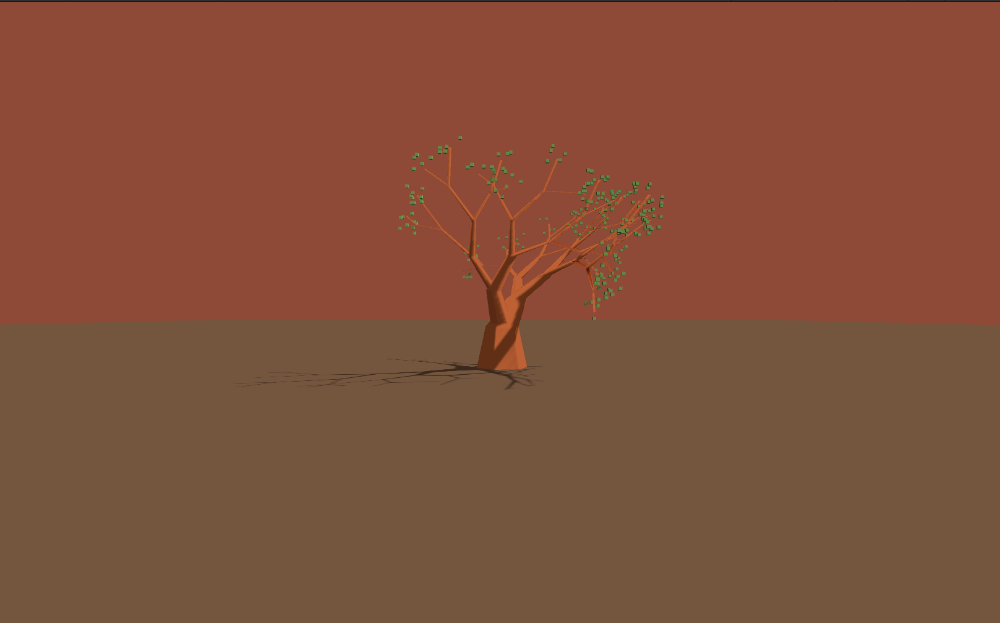
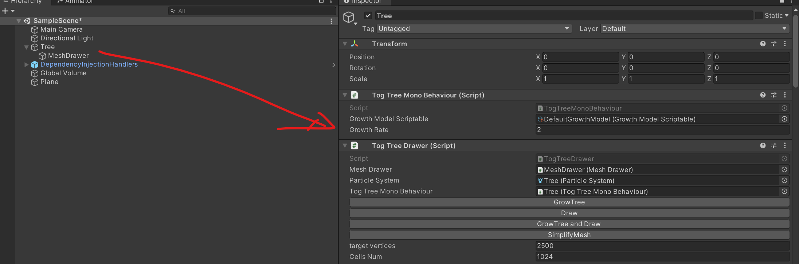
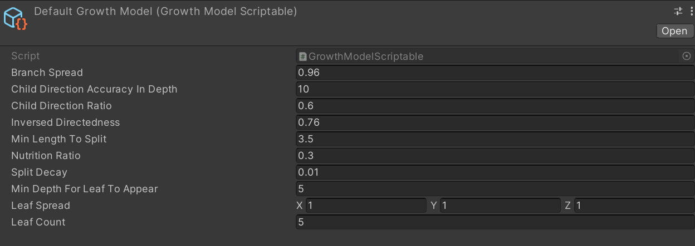

# TOG Tree
> Procedurally Generated Tree in Unity

This is an experiment project based on [an algorithm created by Nicholas McDonald](https://weigert.vsos.ethz.ch/2020/10/19/transport-oriented-growth-and-procedural-trees/), I hold no credits towards the creation of the algorithm, the main work here was to port the algorithm into C# and make everything works in Unity. 

This is not meant for commercial use, but feel free to experiment with it.

## Usage

To reproduce the outcome, please follow the following steps:
1. Open SampleScene
2. Press "Start"
3. Find the "Tree" `gameObject`
4. Press "GrowTree and Draw" to visualize the tree growth
5. As an extra step, you can also press "SimplifyMesh" to eliminate mesh intersections and reduce the amount of vertices.
    - "target vertices" - refers to target amount of vertices, lower it is, the lower quality of the final output.
    - "Cells Num" - the higher Cells Num is, the higher quality the final output will be, note it also takes longer to run. 

You can also tweak related settings in the "DefaultGrowthModel" scriptable object

## Credits

Credits to where credit is due :)

[Nicholas McDonald](https://weigert.vsos.ethz.ch/about/) – For creating the algorithm

[Colin Leung](https://github.com/ColinLeung-NiloCat) – I used the [toon shader he created](https://github.com/ColinLeung-NiloCat/UnityURPToonLitShaderExample) for better visuals.

[Geometry3Sharp Creators](https://github.com/gradientspace/geometry3Sharp) - The library is used to deal with mesh simplification
